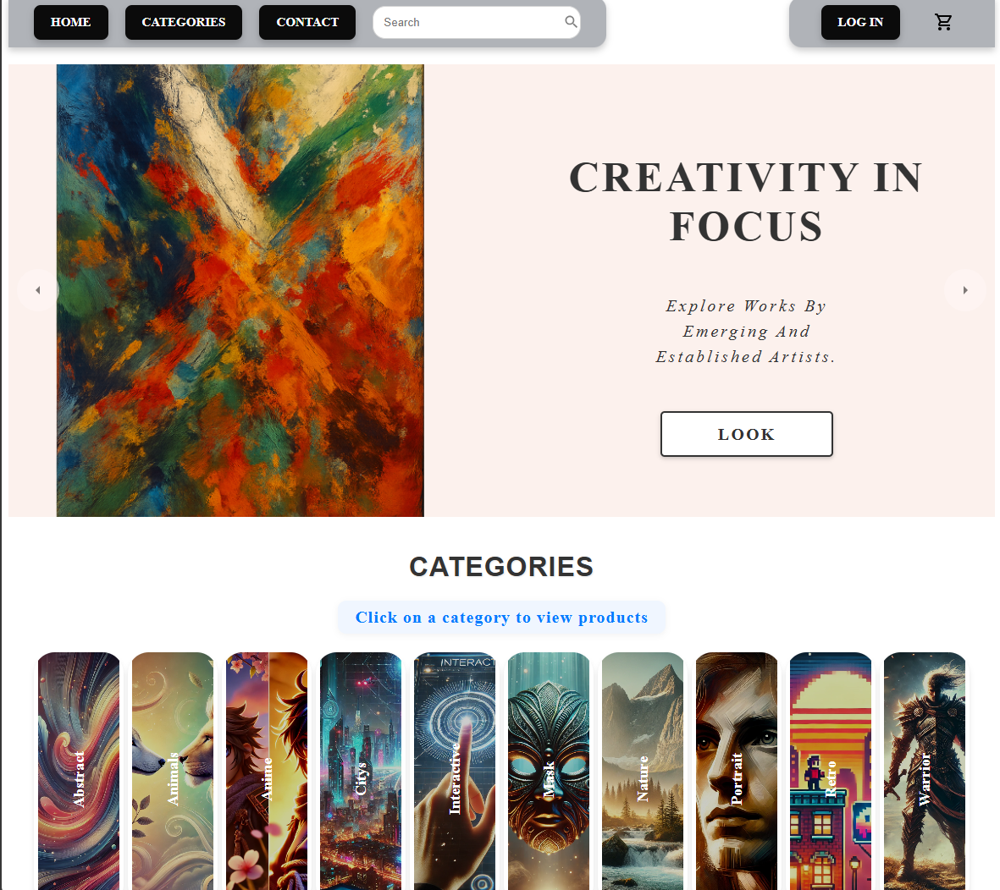

<h1 align='center'>Webshop 🛍️</h1>

<p align="center">A simple webshop project built with Vite, HTML, CSS, and JavaScript. The project serves as a training/learning exercise for frontend development.</p>

---

## Features

- 🛒 Display products  
- ➕ Add products to shopping cart  
- 🗑️ Remove products from shopping cart  
- 💰 View total price  

*(Extend this list as you add more features)*  

---

## Technologies

- **Vite** – development server and build tool  
- **JavaScript (ES6+)** – logic  
- **HTML5** – structure  
- **CSS3** – styling  
- **npm** – package manager for dependencies and scripts  

---

## Project Structure

```
Webshop/
├── public/            # Static files
├── src/               # Source code
│   ├── components/    # Reusable components (if added)
│   ├── assets/        # Images, icons, CSS
│   └── main.js        # Entry point
├── index.html         # Main page
├── package.json       # Dependencies and scripts
├── vite.config.js     # Vite configuration
└── README.md          # Documentation
```

---

## Installation

1. Clone the repository: 
```
git clone https://github.com/Jojje84/Webshop.git
cd Webshop
```

2. Install dependencies:
```
npm install
```

3. Start the development server:
```
npm run dev
```

4. Open in your browser:

- http://localhost:5173

---

## Build for Production
```
npm run build
```

Creates a dist/ folder with optimized files.

To preview the production build locally:
```
npm run preview
```

---

## Screenshots

- Homepage


---

## License

This project is licensed under the MIT License - see the [LICENSE](LICENSE) file for details.

---

## Contact

👤 Jorge

[](https://github.com/Jojje84) 
&nbsp;
[](mailto:jorgeavilas@icloud.com) 
&nbsp;
[](https://www.linkedin.com/in/jorge-avila-35622030/)
